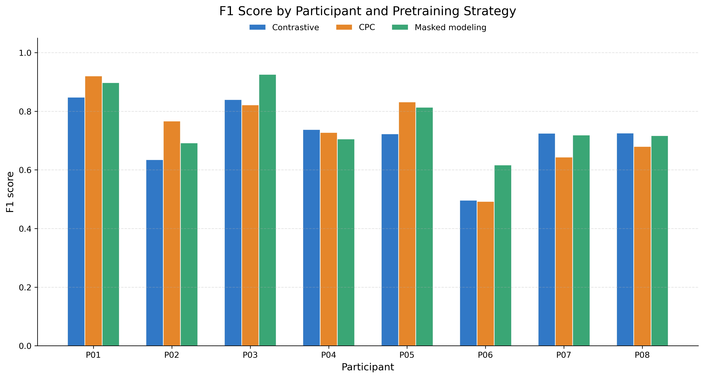

# AllyACC

This repository accompanies the paper: [Giving Meaning to Movements (CHI 2026)](https://a11y.ist.psu.edu/downloads/CHI_2026__Giving_Meaning_to_Movements.pdf).

It provides the implementation of AllyACC introduced in that paper.

## Android app

The Android app is included as the `AllyACCApp` submodule. Please see `AllyACCApp/README.md` for app-specific setup and usage details.

After cloning, run `git submodule update --init --recursive` to fetch the `AllyACCApp` folder.

## Data
The dataset is available in the `dataset` folder. 
For each participant, the data is split into training and test sets. 
Only the IMU data is included here. To protect participant privacy, 
we are not sharing the original video data at this stage. 
We plan to release a privacy-preserving version of the video data, 
either by de-identifying the videos through face and identifiable-feature 
blurring or by providing pose/skeleton representations that preserve the 
necessary motion information for activity recognition.

## Model training

The training scripts use Python 3.11. The released dependency list was created from the `act_recog` conda environment, which used Python 3.11.11.

Install the model-training dependencies with a Python virtual environment:

```bash
python3.11 -m venv .venv
source .venv/bin/activate
python -m pip install --upgrade pip
python -m pip install -r requirements.txt
```

The scripts load participant configs from `config/pretraining` and `config/supervised_training`. Data is read from `dataset`, pretrained models are written to `pretrained_*_models`, and supervised results are written to `output`.

Run the three pretraining scripts first:

```bash
python model/train_contrastive.py
python model/train_cpc.py
python model/train_mask_modeling.py
```

Then run supervised training:

```bash
python model/supervised_train_on_all_task.py
```

## Results

Note: We cleaned up the data and reran the training. The updated results are shown below. The best pretraining strategy for each motor-impaired participant is unchanged from the paper, although the updated results show slight numerical differences.

